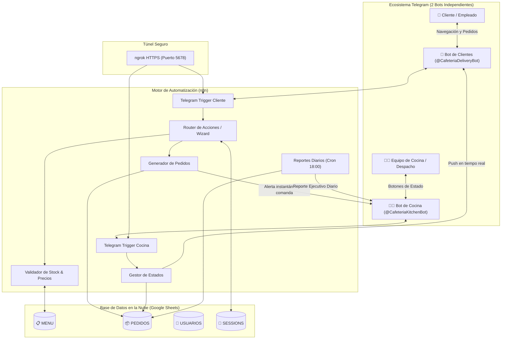
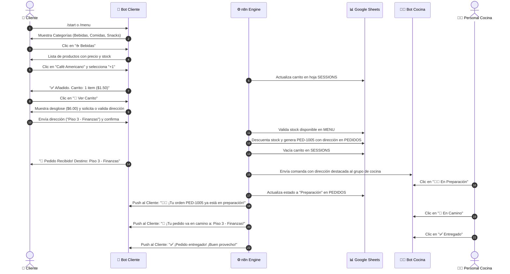

# 🍔 DeliveryBot – Gestión Inteligente de Pedidos Internos de Cafetería

[](https://n8n.io/)
[](https://core.telegram.org/bots)
[](https://sheets.google.com)
[](https://ngrok.com/)
[](#)
[](LICENSE)

> **Solución integral de automatización basada en n8n que convierte a Telegram en una terminal inteligente de pedidos para cafeterías en oficinas, universidades y centros corporativos.**

---

## 📌 Contexto y Problemática

En entornos institucionales con alta afluencia de personas, la gestión manual de pedidos de cafetería suele colapsar:
- **Filas interminables** en horas punta que reducen la productividad y generan frustración.
- **Pérdida y errores de pedidos** debido a notas en papel o mensajes dispersos en chats personales.
- **Descoordinación en cocina**, pues el personal no cuenta con una comanda digitalizada y priorizada.
- **Incertidumbre del cliente**, quien no sabe si su comida tardará 5 o 30 minutos.
- **Falta de métricas de negocio**, impidiendo conocer productos de baja rotación o ingresos reales por día.

---

## 💡 La Solución DeliveryBot

**DeliveryBot** digitaliza y automatiza el ciclo de vida completo de un pedido mediante una **arquitectura de dos bots de Telegram**:
1. **Bot de Clientes (`@CafeteriaDeliveryBot`)**: Interfaz conversacional amigable para consultar el menú por categorías, armar carritos, verificar stock y rastrear estados en tiempo real.
2. **Bot de Cocina / Terminal (`@CafeteriaKitchenBot`)**: Terminal comandera privada para el equipo de cocina, con botones interactivos para cambiar estados de pedidos con un solo clic y push instantáneo al usuario.

---

## 🏗️ Arquitectura del Sistema (Dual-Bot)



---

## 🎯 Objetivos y Resultados de Negocio

| Métrica / Objetivo | Antes (Manual) | Con DeliveryBot |
| :--- | :--- | :--- |
| **Pérdida de Pedidos** | Frecuente (comandas extraviadas) | **0% de pérdida** (registro automático en la nube) |
| **Tiempo de Espera en Fila** | 15 - 25 minutos | **Reducción del 40%** (pedidos anticipados) |
| **Transparencia al Usuario** | Nula | **100% visibilidad en vivo** (Recibido, Preparación, En camino, Entregado) |
| **Control de Inventario** | Al final del día (a ciegas) | **Descuento automático de stock** en tiempo real |
| **Inteligencia de Ventas** | Conteo manual engorroso | **Reporte gerencial diario** (Producto estrella, hora pico, ingresos) |

---

## 🔄 Flujo Guiado del Usuario (Wizard)



---

## 📊 Modelo de Datos (Google Sheets `DeliveryBot_DB`)

La base de datos utiliza una hoja de cálculo con 4 pestañas especializadas:

### 1. `MENU`
Catálogo digital con validación de inventario en tiempo real:
| Columna | Tipo | Ejemplo | Descripción |
| :--- | :--- | :--- | :--- |
| `id_producto` | String (PK) | `PROD-001` | Identificador único del producto |
| `nombre` | String | `Café Americano 8oz` | Nombre descriptivo para el cliente |
| `descripcion` | String | `Espresso con agua caliente tostado medio` | Detalles del producto |
| `precio` | Float | `1.50` | Precio unitario |
| `categoria` | String | `Bebidas` | `Bebidas`, `Comidas`, `Snacks` |
| `stock` | Integer | `50` | Unidades disponibles (se descuenta al ordenar) |

### 2. `PEDIDOS`
Histórico de transacciones y estados:
| Columna | Tipo | Ejemplo | Descripción |
| :--- | :--- | :--- | :--- |
| `id_pedido` | String (PK) | `PED-1005` | Código de orden único |
| `id_usuario` | Integer | `123456789` | `telegram_id` del solicitante |
| `detalles_pedido` | String | `2x Empanada de Pollo ($4.50), 1x Café ($2.25)` | Desglose legible |
| `total_pago` | Float | `6.75` | Importe total |
| `direccion` | String | `Piso 3 - Finanzas y Contabilidad` | Ubicación o dirección física de entrega |
| `estado` | String | `Recibido` | `Recibido`, `Preparación`, `En camino`, `Entregado`, `Cancelado` |
| `fecha` | Date | `2026-09-02` | Fecha de la orden (`YYYY-MM-DD`) |
| `hora` | Time | `14:20:40` | Hora de registro (`HH:mm:ss`) |

### 3. `USUARIOS`
Directorio de clientes y puntos de entrega:
| Columna | Tipo | Ejemplo | Descripción |
| :--- | :--- | :--- | :--- |
| `telegram_id` | Integer (PK) | `123456789` | Identificador de usuario en Telegram |
| `nombre_completo` | String | `Carlos Mendoza` | Nombre de contacto |
| `departamento_oficina` | String | `Piso 3 - Finanzas` | Destino de entrega interna / Dirección predeterminada |
| `puntos_lealtad` | Integer | `15` | Puntos acumulados por compras |

### 4. `SESSIONS`
Memoria temporal para carritos dinámicos y contexto:
| Columna | Tipo | Ejemplo | Descripción |
| :--- | :--- | :--- | :--- |
| `telegram_id` | Integer (PK) | `123456789` | Usuario en interacción |
| `pantalla_actual` | String | `VIEW_CART` | Estado del wizard (`MAIN_MENU`, `AWAITING_ADDRESS`, etc.) |
| `carrito_temporal` | JSON String | `[{"id_producto":"PROD-001","cantidad":2,...}]` | Array de productos en el carrito |
| `direccion` | String | `Piso 3 - Finanzas` | Última dirección de entrega ingresada |
| `ultimo_cambio` | Timestamp | `2026-09-02T14:20:00Z` | Marca temporal de última acción |

> [!TIP]
> Las plantillas CSV listas para importar se encuentran en la carpeta [`sheets_templates/`](sheets_templates/). Revisa el manual detallado en [`sheets_templates/README_SHEETS.md`](sheets_templates/README_SHEETS.md).

---

## 📈 Inteligencia de Negocios (Reportes Automáticos)

El workflow `03_deliverybot_reportes.json` se ejecuta automáticamente todos los días a las **18:00 hrs** (configurable vía Cron) y genera un reporte gerencial enviado directamente al Bot de Cocina/Administración:

```text
📊 REPORTE GERENCIAL DIARIO DE CAFETERÍA
📅 Fecha Analizada: 2026-09-02

💰 MÉTRICAS FINANCIERAS
• Recaudación Total: $29.75
• Ticket Promedio: $5.95

📦 VOLUMEN DE PEDIDOS
• Total Recibidos: 5 órdenes
• ✅ Entregados con Éxito: 2
• ⏳ En Proceso: 3
• ❌ Cancelados: 0

⭐ PRODUCTO ESTRELLA
• Empanada de Pollo Champiñón (3 unidades vendidas)

⏰ HORA PICO DE DEMANDA
• 14:00 hrs (2 pedidos concentrados)

📍 PUNTO DE ENTREGA FRECUENTE
• Piso 3 - Finanzas (3 pedidos concentrados)

━━━━━━━━━━━━━━━━━━━
DeliveryBot Analytics Engine - Automatización n8n
```

---

## 📂 Estructura del Repositorio

```text
NicoleDeliveryBot/
├── .env.example                     # Plantilla de variables de entorno
├── docker-compose.yml               # Despliegue contenerizado de n8n y ngrok
├── MANUAL_CREDENCIALES.md           # Guía paso a paso de credenciales en Linux y Windows
├── README.md                        # Documentación técnica general
├── google_apps_script/              # Extensiones y automatización para Google Sheets
│   ├── DeliveryBot_AppsScript.js    # Código JavaScript para pegar en Apps Script
│   └── README_APPS_SCRIPT.md        # Manual de instalación del menú en Sheets
├── scripts/
│   ├── build_workflows.js          # Compilador de workflows desde módulos JS
│   ├── start.sh                    # Script de inicio en Linux (ngrok + n8n)
│   ├── start.bat                   # Lanzador de un clic para Windows (CMD/Batch)
│   └── start.ps1                   # Script de inicio en Windows (PowerShell)
├── sheets_templates/                # Plantillas CSV para Google Sheets
│   ├── MENU.csv                    # Menú inicial de bebidas, comidas y snacks
│   ├── PEDIDOS.csv                 # Órdenes de prueba con diversos estados
│   ├── README_SHEETS.md            # Instrucciones de configuración en Google Sheets
│   ├── SESSIONS.csv                # Estructura de sesiones y carrito
│   └── USUARIOS.csv                # Usuarios y departamentos de prueba
└── workflows/                       # Workflows modulares de n8n en JSON
    ├── 01_deliverybot_cliente.json  # Flujo del Bot de Clientes
    ├── 02_deliverybot_cocina.json   # Flujo del Bot de Cocina y Estados
    ├── 03_deliverybot_reportes.json # Flujo de Reportes y Métricas BI
    ├── code_nodes/                  # Scripts JavaScript desacoplados
    │   ├── bi_calc.js
    │   ├── client_logic.js
    │   ├── client_router.js
    │   ├── kitchen_parse.js
    │   └── kitchen_prep.js
    └── deliverybot_completo.json    # Workflow unificado (los 3 flujos juntos)
```

---

## 🚀 Guía de Inicio Rápido en Linux

### 1. Clonar el repositorio
```bash
git clone https://github.com/tu-usuario/NicoleDeliveryBot.git
cd NicoleDeliveryBot
```

### 2. Configurar el archivo `.env`
Copia la plantilla y edita los valores con tus credenciales:
```bash
cp .env.example .env
nano .env
```
Completa las variables esenciales:
- `TELEGRAM_CLIENT_BOT_TOKEN`: Token de `@BotFather` para el bot de clientes.
- `TELEGRAM_KITCHEN_BOT_TOKEN`: Token de `@BotFather` para el bot de cocina.
- `TELEGRAM_KITCHEN_CHAT_ID`: ID del chat o grupo de cocina (ej: `-1001234567890`).
- `GOOGLE_SHEET_ID`: ID de tu hoja de cálculo `DeliveryBot_DB`.
- `NGROK_AUTHTOKEN`: Tu token de ngrok.

> Para obtener cada credencial paso a paso con capturas y detalles, consulta el **[Manual de Credenciales](MANUAL_CREDENCIALES.md)**.

### 3. Configurar Google Sheets con los datos de prueba
1. Crea una hoja de cálculo en [Google Sheets](https://sheets.google.com) llamada `DeliveryBot_DB`.
2. Importa los archivos CSV desde [`sheets_templates/`](sheets_templates/) en sus pestañas correspondientes (`MENU`, `PEDIDOS`, `USUARIOS`, `SESSIONS`).
3. Comparte la hoja con el correo de tu Service Account de Google Cloud con permisos de **Editor**.

### 4. Iniciar el sistema con ngrok y n8n

#### 🐧 En Linux / macOS:
```bash
chmod +x scripts/start.sh
./scripts/start.sh
```

#### 🪟 En Windows:
Puedes hacer **doble clic** sobre `scripts/start.bat` o ejecutar desde PowerShell:
```powershell
Set-ExecutionPolicy -ExecutionPolicy Bypass -Scope Process
.\scripts\start.ps1
```

El script se encargará automáticamente de:
1. Validar las herramientas instaladas.
2. Iniciar el túnel seguro de `ngrok` en segundo plano.
3. Extraer la URL pública dinámica HTTPS.
4. Inyectar la variable `WEBHOOK_URL` requerida por Telegram.
5. Iniciar `n8n` y mostrar el panel de control con todas las rutas.

### 5. Importar y Activar Workflows en n8n
1. Abre [http://localhost:5678](http://localhost:5678).
2. Ve a **Credentials** y añade:
   - `cred-telegram-cliente`: Token del Bot de Clientes.
   - `cred-telegram-cocina`: Token del Bot de Cocina.
   - `cred-google-sheets`: Credencial de Cuenta de Servicio de Google Sheets.
3. Ve a **Workflows** > **Import from File** y selecciona `workflows/deliverybot_completo.json`.
4. Enciende el interruptor a **Active**.

¡El sistema ya está completamente operativo y listo para recibir pedidos! 🎉

---

## ⚡ Automatización en Google Sheets (Google Apps Script)

Si deseas gestionar la cafetería directamente desde la interfaz de Google Sheets, hemos incluido un script administrativo en JavaScript:

1. En tu hoja `DeliveryBot_DB`, ve a **Extensiones** > **Apps Script**.
2. Pega el código de [`google_apps_script/DeliveryBot_AppsScript.js`](google_apps_script/DeliveryBot_AppsScript.js).
3. Guarda y recarga la hoja para desbloquear el menú **☕ DeliveryBot**:
   - 📊 **Reporte del Día**: Muestra en pantalla el balance de ventas, órdenes y hora pico.
   - 📦 **Alerta de Stock Bajo**: Notifica productos con 5 o menos unidades.
   - 🔄 **Restablecer Stock**: Repone todo el menú a una cantidad deseada en 1 clic.
   - 🧹 **Limpiar Sesiones**: Elimina carritos abandonados con más de 24 horas.
   - 🔔 **Notificación Automática (`onEdit`)**: Al cambiar manualmente el estado de una fila en `PEDIDOS`, puede notificar al cliente vía Telegram.

Consulta el manual en [`google_apps_script/README_APPS_SCRIPT.md`](google_apps_script/README_APPS_SCRIPT.md).

---

## 🛠️ Despliegue con Docker Compose (Opcional)

Si prefieres ejecutar el sistema completo dentro de contenedores:
```bash
# Iniciar servicios en segundo plano
docker compose up -d

# Ver logs en tiempo real
docker compose logs -f
```

---

## 👥 Contribuciones y Licencia

Desarrollado bajo licencia **MIT**. Consulta el archivo `LICENSE` para más detalles.

¡Contribuciones, sugerencias y mejoras son bienvenidas mediante Pull Requests o Issues!
